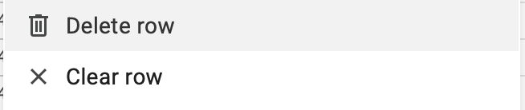

# AUMC Piano Room Access Automation

This script runs on Google Apps Script, and it handles:

- Adding new form submissions to the `db_actif` sheet
- Sending accreditation emails when payment is recorded
- Sending a twice-monthly summary email of newly paid members

## Triggers

| Type | Function Name | Description |
|--------------|--------------|-------------|
| On form submit | `onFormSubmit` | Adds new form submissions to `db_actif` |
| On edit | `onEdit` | Sends accreditation email when payment is entered |
| Time-driven | `sendBiMonthlyReport` | Sends summary email of newly paid EPFL students |

## Usage

### To record a payment

When a student has paid:

1. Enter the date in `salles_piano_paiement` column.
2. The email will be sent to the student automatically.
3. The `mail_sent` checkbox will be updated automatically. (Don't tick it manually!)

>[!Warning]
> Do not add empty rows at the end of `db_actif` sheet. They may be interpreted as valid data.

### To delete a row

Click the row number on the left, then right click and select "Delete row" (not "Clear row").

### To edit email content

1. Go to Extensions > Apps Script, then open `Code.js` file.
2. You can edit the content there. The `htmlBody` inside `onEdit` is the content of the email that will be sent to students, and `body` inside `sendBiMonthlyReport` is the content of the summary email (that will be sent to the email below).

