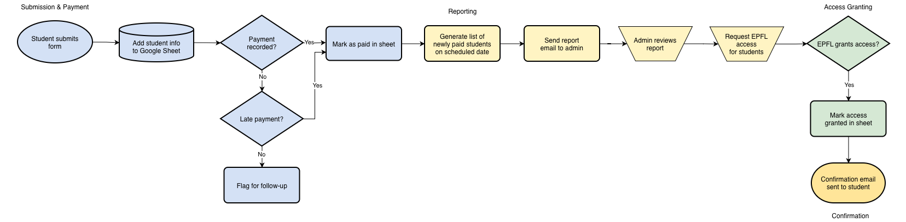

# AUMC Piano Room Access Automation

This script runs on Google Apps Script, and it handles:

- Adding new form submissions to the `db_actif` sheet
- Sending a bi-monthly summary email of newly paid EPFL students to the manager
- Sending confirmation emails to students after EPFL has activated their access rights

## Workflow

1. A student submits the form.
2. `onFormSubmit(e)` runs automatically.
3. A new row is added to `db_actif`.
4. When the student pays, the payment information is entered in `salles_piano_paiement`.
5. On the 1st and 15th of each month, `sendBiMonthlyReport()` sends an internal summary email with newly paid EPFL students whose `summary_sent` value is still `FALSE`.
6. After the summary email is sent successfully, the script updates:
   - `summary_sent = TRUE`
7. The manager uses this summary email to request access rights from EPFL.
8. Once EPFL has activated the access rights, the manager changes:
   - `access_granted: FALSE -> TRUE`
9.  `onEdit(e)` detects this change and sends the confirmation email to the student.
10. After the confirmation email is sent successfully, the script updates:
    - `mail_sent = TRUE`

## Important columns

| Column | Meaning |
|--------------|-------------|
| `salles_piano_paiement` | Payment date or payment confirmation. If this field is filled, the student can be included in the next summary email. |
| `summary_sent` | Indicates whether the student has already been included in the internal bi-monthly summary email. This prevents the same student from being listed multiple times. |
| `access_granted` | Indicates whether EPFL has actually activated the student's access rights. Changing this from `FALSE` to `TRUE` triggers the confirmation email. |
| `mail_sent` | Indicates whether the confirmation email has already been sent to the student. This prevents duplicate confirmation emails. |

## Triggers

| Type | Function Name | Description |
|--------------|--------------|-------------|
| On form submit | `onFormSubmit` | Adds new form submissions to `db_actif` |
| On edit | `onEdit` | Sends the confirmation email when `access_granted` is changed from `FALSE` to `TRUE` |
| Time-driven | `sendBiMonthlyReport` | Sends a summary email of newly paid EPFL students on the 1st and 15th of each month |

## Remark

### Existing students before automation

For students who were already fully processed before this automation was introduced, set the three status columns to:

| Column | Value |
|--------------|-------|
| `summary_sent` | `TRUE` |
| `access_granted` | `TRUE` |
| `mail_sent` | `TRUE` |

This marks them as already processed and prevents duplicate summary entries or confirmation emails.

### How to delete a row

Click the row number on the left, then right click and select "Delete row" (not "Clear row").

>[!Warning]
>Do not add empty rows at the end of the `db_actif` sheet. They may be interpreted as valid data.

### How to edit email content

1. Go to Extensions > Apps Script, then open the `Code.js` file.
2. The `htmlBody` inside `onEdit` is the content of the confirmation email sent to students.
3. The `body` inside `sendBiMonthlyReport` is the content of the internal summary email.